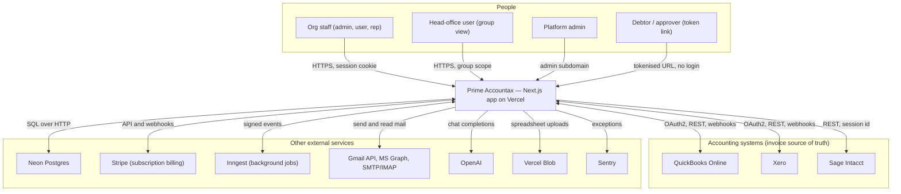

# System Overview

- **Purpose:** What Prime Accountax does, who uses it, and what it is built from.
- **Audience:** A competent developer new to this codebase and to the accounts-receivable domain.
- **Last verified against:** commit `3eec3df` (2026-09-17)
- **Primary sources:** `CLAUDE.md`, `package.json`, `db/schema.ts`, `components/sidebar.tsx`, `lib/modules.ts`, `middleware.ts`, `app/`

## What the system does

**Prime Accountax** is a multi-tenant SaaS application for **accounts receivable
(AR) management and collections**. An organisation connects its accounting
system — QuickBooks Online, Xero, or Sage Intacct — and the app pulls in
customers and invoices, then runs the chasing process on top of them: branded
reminder emails on a schedule, a daily working board of open invoices, a
customer-facing portal where a debtor can promise a payment date or raise a
dispute, and escalation to an account owner when chasing stops working. The
commercial goal is to reduce **DSO** (days sales outstanding — the average time
between issuing an invoice and being paid).

Around that original product, four further areas have been built:

- **Payables (AP)** — suppliers, bills, purchase orders, approval workflows, payment runs.
- **Native accounting** — a standalone general ledger, so an organisation can keep books in the app itself rather than only mirroring a provider.
- **Supply chain** — perpetual FIFO inventory, bills of materials, production builds, goods receipts, shipments, and subcontracted "job work".
- **Data Studio** — spreadsheet-driven bulk import, export, update and delete against QuickBooks and Xero, across roughly 32 entity types.

Evidence: `lib/modules.ts` (`MODULE_KEYS`), `components/sidebar.tsx`
(`WORKSPACES`), `db/schema.ts`.

## Who uses it

| User | How they reach the system | What they do |
|---|---|---|
| **Company user** (`company_user`) | Signs in to the app | Works the collections board, records notes and payments, posts goods receipts / shipments / production builds |
| **Company admin** (`company_admin`) | Signs in to the app | Everything above, plus master data, posting money documents, voiding, settings, integrations |
| **Sales rep** (`rep`) | Signs in; confined to `/rep-portal` | Sees only their own customers' receivables |
| **Head-office manager/finance** (`ho_manager`, `ho_finance`) | Signs in, selects a group | Consolidated read across every organisation in an org group |
| **Platform admin** (`platform_admin`) | `admin.primeaccountax.com` | Onboards customers, assigns modules, manages Stripe billing, runs reconciliation |
| **Super admin** (`super_admin`) | Same, plus any org | Everything, including cross-org access |
| **Debtor (a customer's accounts-payable clerk)** | Tokenised link in an email — no login | Views open invoices, promises a date, raises a dispute, pays online via QuickBooks |
| **Escalation owner** | Tokenised link — no login | Reviews an escalated invoice handed to them |
| **Bill approver** | Tokenised link — no login | Approves or rejects a payable |

Evidence: role strings in `middleware.ts` and `lib/api.ts`; portals under
`app/portal/[token]/`, `app/owner-portal/[token]/`, `app/approver/[token]/`.

## Domain context

Terms used throughout; the full list is in [glossary.md](glossary.md).

- An **invoice** is money owed to the organisation by a customer. Its **balance** is total minus paid.
- **Aging** groups open balances by how overdue they are (Current, 1–30, 31–60, 61–90, 90+) **as at** a chosen date.
- A **collection stage** is the single dynamic state of an invoice in the chasing process (New, then chased, then Promised / Disputed / Escalated / Closed). Stages are per-organisation and editable, with four locked keys.
- A **promise to pay** is a debtor's commitment to a date. It is `Active`, then `Met`, `Broken`, or `Superseded`.
- A **dispute** pauses automation on an invoice until it is resolved.
- The **general ledger (GL)** is the double-entry book: every transaction is a balanced set of debit and credit lines.

## Scope and non-goals

**In scope**

- Reading invoices, customers and payments from QuickBooks Online, Xero and Sage Intacct.
- Sending collections email from the organisation's *own* mailbox (Gmail, Microsoft 365, or SMTP).
- A customer portal for promises, disputes, statements, and QuickBooks-hosted payment.
- A native double-entry ledger with immutable, reversal-only entries.
- Bulk write-back to QuickBooks and Xero through Data Studio.
- Per-organisation module entitlement and Stripe subscription billing.

**Explicit non-goals, evidenced in the code**

- **The app never takes card payments for AR invoices.** The "Pay online" affordance hands the debtor QuickBooks' own hosted payment page (`lib/qbo-token.ts`, `fetchQboInvoicePayInfo`). Building payment collection is recorded as a separate, larger feature.
- **Card data never touches the app** for subscription billing either; Stripe is the source of truth (`CLAUDE.md`, `lib/billing.ts`).
- **The app does not present QuickBooks' own trial balance as its own.** A native financial statement must come from `journal_lines`; `tests/architecture.test.ts` enforces this.
- **No per-organisation branding of outbound transactional email.** `lib/system-mailer.ts` hardcodes "Prime Accountax" globally. White-labelling currently covers pre-auth pages on a branded subdomain only.
- **Mobile is a separate project** (`mobile/`), excluded from this documentation set.

## Technology stack

| Layer | Choice | Where |
|---|---|---|
| Framework | Next.js 14.2.5, App Router, React 18 | `package.json`, `app/` |
| Language | TypeScript 5.5 — note `strict: false` | `tsconfig.json` |
| Database | Neon serverless Postgres over HTTP | `db/index.ts` |
| ORM / migrations | Drizzle ORM 0.30 + drizzle-kit 0.21 | `db/schema.ts`, `db/migrations/` |
| Auth | NextAuth v5 beta, JWT sessions, credentials provider | `lib/auth.ts`, `auth.config.ts` |
| Styling | Tailwind CSS 3.4, CSS-variable theming (dark/light/system) | `tailwind.config.js`, `app/globals.css` |
| Background jobs | Inngest 4.5 (event-driven and cron) plus Vercel Cron (HTTP) | `inngest/`, `vercel.json` |
| Billing | Stripe 22 | `lib/stripe.ts`, `lib/billing.ts` |
| Email | nodemailer (SMTP), Gmail API, Microsoft Graph; imapflow for inbound | `lib/mailer.ts`, `lib/admin-mailbox.ts` |
| Documents | `pdf-lib`, `unpdf`, `exceljs`, `xlsx`, `jszip` | `lib/statement-pdf.ts`, `lib/qbo-pay-button.ts`, `lib/batch/` |
| AI | OpenAI SDK (in-app chat and a next-action suggester) | `app/api/chat/route.ts` |
| Errors | Sentry, inert unless a DSN is set | `sentry.*.config.ts`, `next.config.js` |
| Hosting | Vercel; deploys on push to `main` | `vercel.json`, `CLAUDE.md` |
| Tests | Vitest 2 — unit only, no database, no network | `vitest.config.ts`, `tests/` |

Scale, for orientation: about 125 tables, 87 migrations, 422 API route handlers,
175 pages, 141 library modules, 68 components, 1,231 commits between 2026-05-06
and 2026-09-17.

## System context

How to read it: everything in the middle box is one deployable — a single
Next.js application, not a set of services. The three accounting systems on the
right are the authority for invoice data in most organisations; the app mirrors
them into its own Postgres rather than querying them per request. The
distinction that matters most is at the top left: staff arrive with a session
cookie and are scoped to one organisation, while debtors and approvers arrive
with a signed token and no account at all, which is why those routes bypass
authentication entirely in `middleware.ts`.

## Sources

`CLAUDE.md`; `package.json`; `tsconfig.json`; `next.config.js`; `vercel.json`;
`middleware.ts`; `db/index.ts`; `db/schema.ts`; `lib/api.ts`; `lib/modules.ts`;
`lib/mailer.ts`; `lib/qbo-token.ts`; `components/sidebar.tsx`;
`tests/architecture.test.ts`; `git log`.
