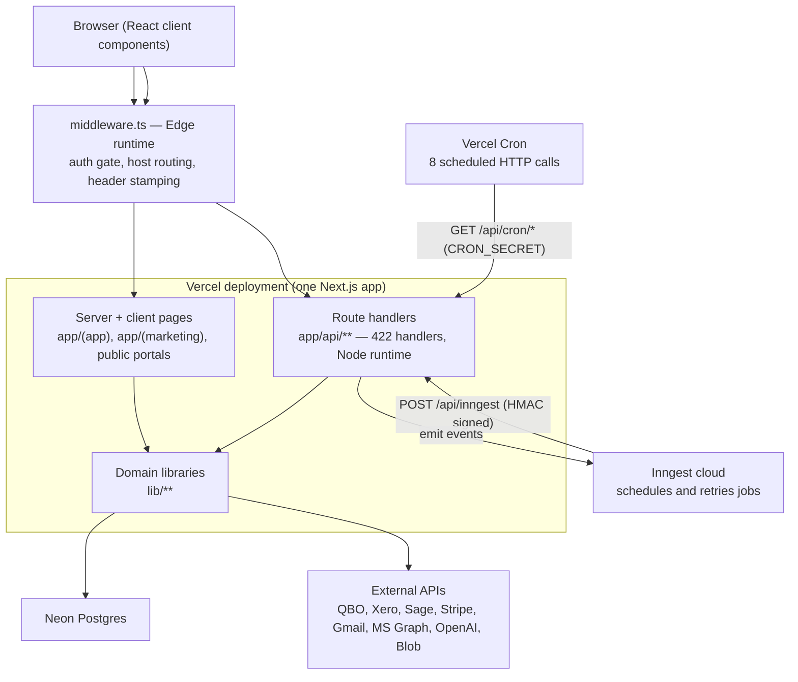
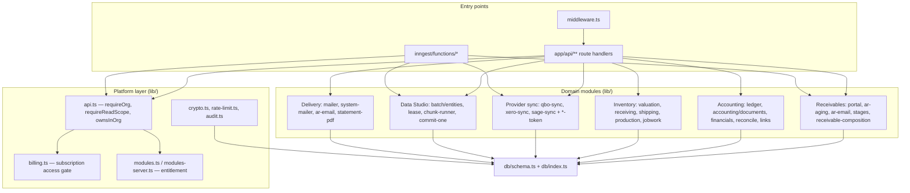

# Architecture

- **Purpose:** The architectural style, the runtime pieces, how the modules depend on each other, and the cross-cutting concerns that apply everywhere.
- **Audience:** A developer who needs to place a change correctly before making it.
- **Last verified against:** commit `3eec3df` (2026-09-17)
- **Primary sources:** `app/`, `lib/`, `middleware.ts`, `db/index.ts`, `inngest/`, `next.config.js`, `vercel.json`, `tests/architecture.test.ts`

## Architectural style

A **modular monolith deployed as serverless functions**. One Next.js App Router
application holds the UI, the HTTP API, and the domain logic; Vercel splits it
into per-route functions at deploy time. There are no internal services and no
message bus of our own — the only asynchronous machinery is Inngest, which calls
back into the same application over HTTP.

Three consequences shape almost every decision in the codebase:

1. **No database transactions.** The Neon HTTP driver sends each statement as a
   separate `fetch`. `db.transaction()` throws. Multi-statement writes are
   therefore written as *validate fully, then write, then compensate on failure*
   (see `lib/ledger.ts`) or as a single atomic conditional `UPDATE`
   (see `lib/batch/lease.ts`). Nothing may assume atomicity across statements.
2. **Functions are short-lived.** Any job that can exceed a function's time
   limit has to be resumable. That is why bulk work is chunked with a lease and
   a cursor rather than run in a loop inside a request.
3. **Nothing is trusted from the JWT.** A serverless function has no memory
   between requests, so authorisation is re-derived from the database on every
   call (`lib/api.ts`, `requireOrg()`).

[INFERRED] The style was not chosen in a design document; it follows from the
Vercel + Neon hosting choice and is consistently respected in the code and in
`CLAUDE.md`.

## Containers

How to read it: every arrow into the deployment is HTTP, including the ones from
Inngest and Vercel Cron — background work is not a separate process, it is the
same application invoked from outside. `middleware.ts` runs on Vercel's Edge
runtime and is the only component that sees *every* request; everything below it
runs on Node. The domain libraries in `lib/` are the only layer that talks to
Postgres or to third parties, which is what makes them unit-testable without
either.

## Components

How to read it: dependencies point downward only. Route handlers and Inngest
functions are interchangeable callers of the same domain modules — that is
deliberate, and it is why the daily chase exists in two places (an Inngest
function and a legacy cron route) without duplicating the email logic. The
platform layer is where a request earns the right to touch a domain module; a
domain module never re-checks authorisation itself.

## Layering rules

| Rule | Enforced by |
|---|---|
| Route handlers hold no business logic worth testing; extract it to `lib/` first | Convention, stated in `CLAUDE.md`; examples: `lib/portal-response.ts`, `lib/ar-email.ts` |
| Client components never import server-only modules | `tests/architecture.test.ts` ("client bundles never reach server-only modules") |
| `lib/modules.ts` (client-safe) and `lib/modules-server.ts` (imports `db`) stay separate | Same test |
| Native financial statements never call QuickBooks | `tests/architecture.test.ts` |
| The QuickBooks GL ingestion is reachable only from `scripts/` | `tests/architecture.test.ts` |
| Money columns are never `real()` in the native ledger | `tests/architecture.test.ts` |
| A calendar date is never rendered through a timezone | `tests/architecture.test.ts`, `tests/date-display.test.ts` |
| No `GROUP BY` directly on a view-backed table's column | `tests/architecture.test.ts` |

`tests/architecture.test.ts` is unusual and worth reading early: it is a set of
grep-based structural assertions, each written after a real incident, and each
demonstrated to fail on the violation it guards.

## Key patterns

**Org scoping as a function, not a filter.** `requireOrg()` returns
`{ error, session, orgId, role, repId }`; every handler starts by calling it and
returning `error` if present. It re-reads the user row, checks `status`, and
requires a live `user_organisations` membership for the org being acted on —
the JWT is only a hint. `requireReadScope()` widens reads to an org *group* when
one is selected; writes deliberately keep using `requireOrg()` because a write
always targets exactly one organisation.

**Defence in depth for entitlement.** Hiding a nav link is not considered
sufficient. `requireModule(orgId, key)` is called inside module-gated API routes
so a direct request returns a real 403.

**Cross-tenant foreign keys are checked explicitly.** A Postgres foreign key
proves a row exists, not that it belongs to the caller's organisation.
`ownsInOrg()` and `userInOrg()` in `lib/api.ts` exist to close that
insecure-direct-object-reference gap on any id accepted from a request body.

**Immutability in the ledger.** `postJournalEntry` validates balance and account
ownership before writing anything, then inserts the header and the lines, and
deletes the header if a line insert fails. Corrections are posted as reversals;
entries are never edited or deleted. Mirrored provider entries are the one
exception — they are *replaced*, because the provider is the book of record.

**Derived state has exactly one writer.** `invoices.paid` and
`invoices.paymentStatus` are a cache of the settlement graph, written only by
`syncNativeInvoicePaid` (native) or the provider sync (mirrored). This is called
out in `CLAUDE.md` as a rule that has been broken before.

**Lease and cursor for long jobs.** `lib/batch/lease.ts` provides
`claimChunk` / `recordItem` / `finishChunkCall` / `runChunkLoop`. Each is a
single atomic `UPDATE`, so two overlapping invocations never process the same
cursor, and a crash loses at most the in-flight item.

**Registry-driven bulk operations.** `lib/batch/entities.ts` declares, per entity
type, its `columns`, a `build` (sheet to provider payload), `toRows` (provider
record to sheet), and reference lists. Adding an entity is a registry entry, not
a code path.

## Cross-cutting concerns

| Concern | Implementation | Notes |
|---|---|---|
| **Authentication** | NextAuth v5, JWT strategy, credentials provider (`lib/auth.ts`). 8-hour session. Mobile uses `Authorization: Bearer` verified in `lib/api.ts`. | `auth.config.ts` is a second, Edge-safe config with no Node or DB imports, used only by middleware. |
| **Authorisation** | `requireOrg` / `requireReadScope` / `requirePlatformAdmin` / `requireModule`; role checks in `middleware.ts` for whole URL families. | Roles: `super_admin`, `platform_admin`, `company_admin`, `company_user`, `rep`, plus group roles `ho_manager` / `ho_finance`. |
| **Multi-tenancy** | Every tenant table carries `org_id`; queries filter on it. No row-level security in the database. | The application is the only enforcement point. |
| **Configuration** | `process.env` read at point of use; no central config module. | See [07-configuration-and-environments.md](07-configuration-and-environments.md). |
| **Secrets at rest** | `lib/crypto.ts` — AES-256-GCM, key derived from `ENCRYPTION_KEY` or `AUTH_SECRET`. Reads pass through unprefixed legacy plaintext. | Applied to mailbox passwords and OAuth tokens. |
| **Error handling** | Route handlers return `{ error }` JSON with an HTTP status via `bad()` / `ok()`. Background jobs log and continue. Sentry captures exceptions when a DSN is set. | Non-critical side effects (audit log, communication log, PDF attach) are deliberately `.catch()`-swallowed so they cannot break the primary action. |
| **Logging** | `console.log` / `console.warn` / `console.error` to Vercel's log drain. Domain events go to the `audit_events` table via `lib/audit.ts`. | No structured logging library. |
| **Retries** | Neon fetch failures retried 3 times with backoff in `db/index.ts`. Inngest functions declare `retries`. Provider sync throttles with explicit `sleep()` calls. | |
| **Rate limiting** | `lib/rate-limit.ts` — atomic fixed-window counter in Postgres, **fail-open** by design. | A separate `lib/batch/qbo-rate-limiter.ts` governs QuickBooks call volume. |
| **Caching** | In-process memoisation only (for example the QuickBooks pay-link preferences, 60 s / 10 min). Client data is held in a React context (`components/data-provider.tsx`). | No Redis, no external cache. |
| **Theming** | CSS variables in `app/globals.css`, resolved through `rgb(var(--…))` in `tailwind.config.js`. **Tailwind class names must never be built at runtime** — the scanner only sees literal strings. | |
| **Dates** | `lib/format.ts` `dateParts()` reads `YYYY-MM-DD` literally and never constructs a `Date` for a date-only value. | This is the fix for a real cross-timezone off-by-one; see [05-key-flows.md](05-key-flows.md) and the ADR. |

## Request lifecycle

1. **Edge middleware** (`middleware.ts`) runs first on every non-excluded path.
   It resolves the JWT session, routes the `admin.` host to `/admin/*`, serves a
   placeholder on `*.vercel.app`, lets public, portal, cron and webhook paths
   through, stamps `x-org-subdomain` for white-label pre-auth pages, and
   redirects or 401s everything else.
2. **Route handler or server component** runs on Node. The first statement of a
   protected handler is `requireOrg()` (or a sibling), which re-validates the
   user and resolves the active organisation from the `active_org_id` cookie.
3. **Domain library** performs the work against Postgres and, where relevant, a
   third-party API.
4. **Response**. Audit and communication logging happen on a best-effort basis
   and never fail the request.

## Sources

`middleware.ts`; `auth.config.ts`; `lib/auth.ts`; `lib/api.ts`;
`lib/modules.ts`; `lib/modules-server.ts`; `lib/ledger.ts`;
`lib/accounting/documents.ts`; `lib/batch/lease.ts`; `lib/batch/entities.ts`;
`lib/crypto.ts`; `lib/rate-limit.ts`; `lib/audit.ts`; `db/index.ts`;
`inngest/index.ts`; `app/api/inngest/route.ts`; `next.config.js`;
`tests/architecture.test.ts`; `CLAUDE.md`.
