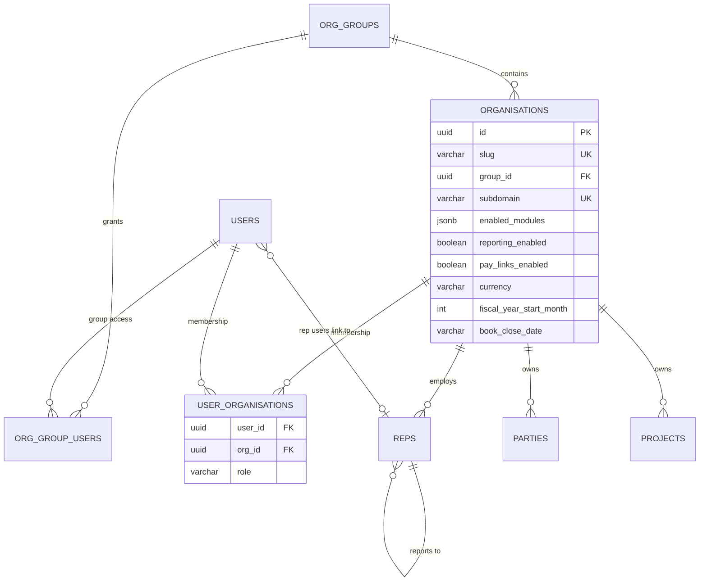
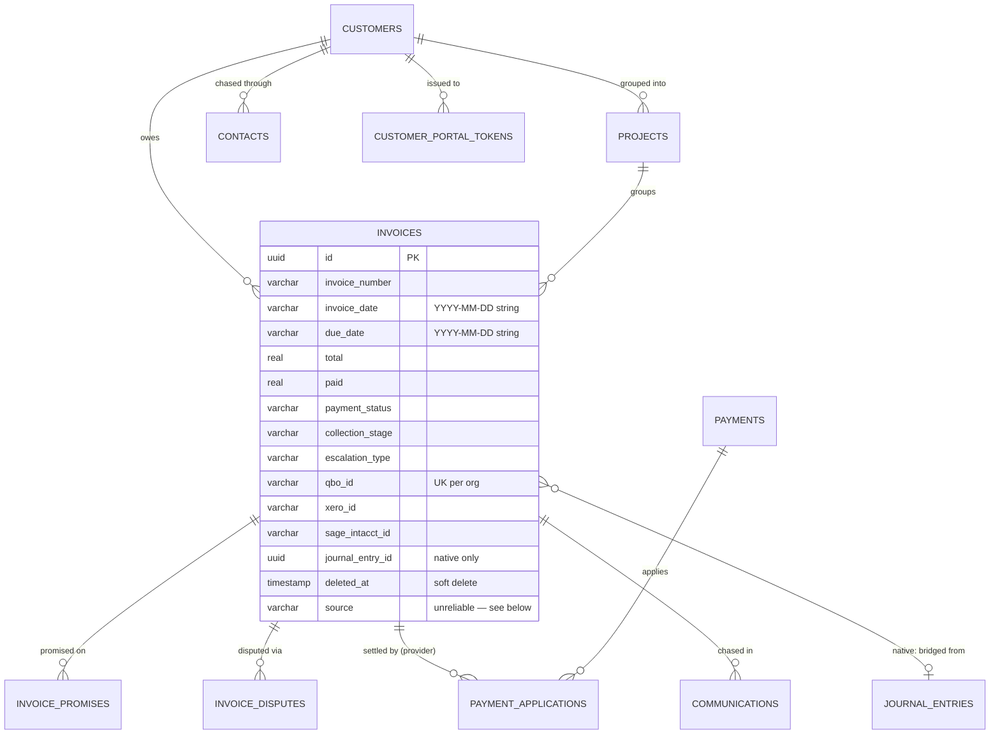
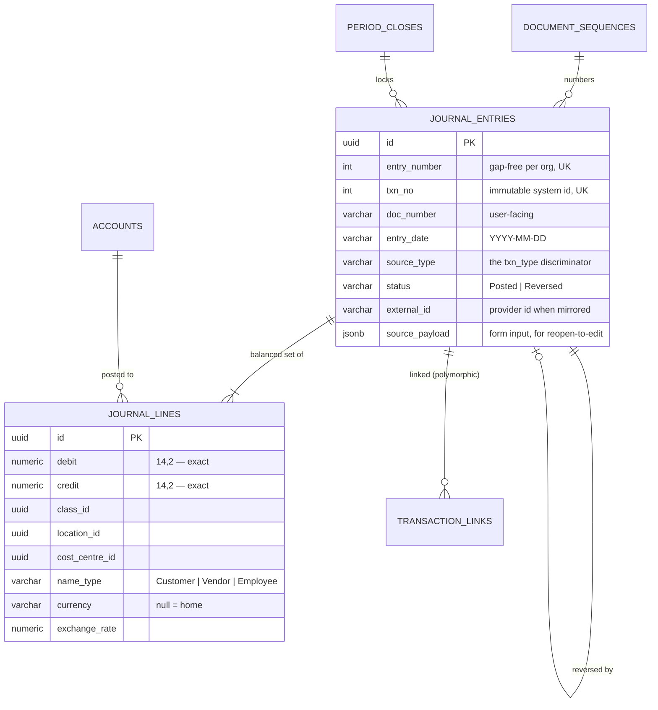
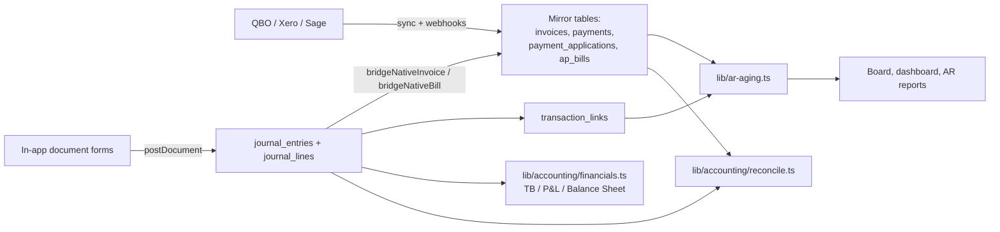

# Data Model

- **Purpose:** The core entities, how they relate, how the schema is changed, and the two places where the model has known seams.
- **Audience:** A developer writing a query, adding a column, or trying to work out which of two similar tables is authoritative.
- **Last verified against:** commit `3eec3df` (2026-09-17)
- **Primary sources:** `db/schema.ts`, `db/migrations/`, `db/index.ts`, `lib/ledger.ts`, `lib/ar-aging.ts`, `lib/accounting/reconcile.ts`

## Storage

One **Neon serverless Postgres** database, reached over HTTP with Drizzle's
`neon-http` driver (`db/index.ts`). `DATABASE_URL` is read lazily at runtime, so
a missing value does not break the build. Transient `fetch` failures are retried
three times with backoff; a real Postgres error status is not retried.

**There are no transactions.** `db.transaction()` throws. This is the single most
important fact about writing to this database.

`db/schema.ts` is the whole schema in one 3,145-line file: about 125 tables,
grouped by comment banners. Types are derived (`typeof table.$inferSelect`) and
exported alongside each table.

## Entity groups

| Group | Representative tables |
|---|---|
| Tenancy and identity | `organisations`, `org_groups`, `org_group_users`, `users`, `user_organisations`, `sessions`, `reps`, `regions`, `countries` |
| Commercial (platform) | `subscriptions`, `stripe_webhook_events`, `billing_audit_logs`, `cancellation_requests`, `pending_registrations`, `temp_access_requests` |
| Platform CRM | `landing_page_requests`, `crm_accounts`, `crm_activities`, `crm_emails`, `crm_campaigns`, `opportunities`, `lead_*`, `forecast_snapshots` |
| Parties (shared master data) | `parties` (+ the `customers` and `ap_suppliers` **views**), `contacts`, `ap_supplier_contacts`, `employees`, `projects` |
| Receivables | `invoices`, `payments`, `payment_applications`, `refund_receipts`, `deposits`, `invoice_promises`, `invoice_disputes`, `customer_portal_tokens`, `owner_portal_tokens`, `communications`, `tasks`, `email_templates`, `reminder_schedules`, `estimates` |
| General ledger | `journal_entries`, `journal_lines`, `accounts` (alias `ap_accounts`), `document_sequences`, `period_closes`, `transaction_links`, `bank_reconciliations`, `ap_dimensions`, `ap_tax_rates` |
| Payables | `ap_bills`, `ap_bill_lines`, `ap_approvals`, `ap_workflow_rules`, `ap_supplier_queries`, `purchase_requests`, `purchase_orders`, `purchase_order_lines`, `payment_runs`, `payment_run_items`, `ap_approval_tokens`, `ap_bill_comments` |
| Trade documents | `trade_documents`, `trade_document_lines` (estimates, purchase orders, sales orders — non-posting) |
| Inventory and manufacturing | `ap_items`, `item_skus`, `item_supplier_skus`, `inventory_lots`, `inventory_movements`, `boms`, `bom_lines`, `production_runs`, `production_consumptions`, `manufacturing_orders`, `mo_outputs`, `production_outputs`, `goods_receipts(+_lines)`, `sales_shipments`, `shipment_lines`, `job_work_orders`, `job_work_receipts`, `supply_chain_alerts`, `approval_thresholds`, `pending_approvals` |
| Integrations | `qbo_tokens`, `qbo_sync_log`, `qbo_webhook_events`, `qbo_rate_limits`, `xero_tokens`, `xero_sync_log`, `xero_webhook_events`, `sage_intacct_credentials`, `sage_sync_log`, `gmail_tokens`, `microsoft_tokens`, `google_sheets_tokens`, `org_smtp_settings`, `org_email_settings`, `admin_email_accounts` |
| Data Studio | `batch_jobs`, `batch_import_mappings`, `scheduled_imports` |
| Reporting | `reporting_dimensions`, `reporting_dimension_values`, `reporting_rules`, `reporting_overrides` |
| Resources | `resources`, `resource_assignments` |
| Cross-cutting | `audit_events`, `rate_limits`, `guide_pages`, `crm_field_defs`, `crm_field_values` |

## Tenancy

How to read it: `user_organisations` is the junction that actually authorises
access — `users.org_id` is only a default hint, and `requireOrg()` will not trust
it without a matching junction row. `org_groups` sits above organisations to
provide a consolidated head-office read; group access is granted independently of
per-organisation membership, so one person can be a branch user *and* hold group
access. Almost every other table in the system carries `org_id` with
`ON DELETE CASCADE` to `organisations`.

## Receivables

Three things about `invoices` that will otherwise cost you a day:

1. **Dates are strings, not dates.** `invoice_date`, `due_date`, `paid_at`,
   `promise_date` are `varchar(16)` holding a literal `YYYY-MM-DD`, copied
   verbatim from the provider. This is intentional — a due date is a calendar
   fact with no timezone. Render it through `lib/format.ts`; never construct a
   `Date` from it.
2. **`source` does not reliably mean what it says.** `invoices.source` and
   `ap_bills.source` default to `'native'` and the provider syncs do not
   consistently overwrite them, so thousands of provider-synced rows are labelled
   native while carrying a `qbo_id`. To tell native from mirrored, use
   `journal_entry_id` (ours) and the provider id columns (theirs).
3. **Deletion is soft.** `deleted_at` is set when the provider reports the
   invoice gone. This is deliberately distinct from `payment_status = 'Written Off'`,
   which is a real accounts-receivable concept.

## General ledger

How to read it: `journal_entries` **is** the transaction header — there is no
separate `transactions` table and none is needed. `source_type` is the document
type discriminator (Invoice, Bill, Payment, CreditNote, Manual, Reversal), and
the typed document lines are `journal_lines` carrying full dimensions. The model
is deliberately QuickBooks-shaped, but stricter: entries are immutable and
corrections are reversals, where QuickBooks allows silent edits.

Invariants enforced by `lib/ledger.ts` before anything is written:

1. Debits equal credits, to the cent (tolerance 0.005).
2. Each line has exactly one side, greater than zero.
3. Every account exists in the organisation and is Active.
4. Entries are never edited or deleted — only reversed.

Because there are no transactions, the header is inserted first and the lines
second; if a line insert fails the header is deleted as a compensating action.
All validation happens before the first write, so the only failure mode inside
the write window is infrastructure.

## Two seams you must know about

### 1. `customers` and `ap_suppliers` are VIEWS, not tables

Migration `0079_unify_parties.sql` (2026-09-06) moved both party types into one
physical `parties` table with a `party_type` discriminator. `customers` and
`ap_suppliers` remain as compatibility views with `INSTEAD OF` triggers
forwarding `INSERT` / `UPDATE` / `DELETE` / `RETURNING` into `parties`, so
existing queries were unaffected. `customers_legacy` and `ap_suppliers_legacy`
hold the pre-migration data as an audit trail and have not been dropped.

Consequences that have already bitten:

- **A new foreign key cannot target `customers.id` or `ap_suppliers.id`** — Postgres cannot reference a view. Target `parties.id`.
- **`GROUP BY` on a view column fails.** Postgres only treats other selected columns as functionally dependent on a grouped column when that column is a real primary key. `GROUP BY apSuppliers.id` while selecting other columns raises `column "s.org_id" must appear in the GROUP BY clause` — a 500 on the page, invisible to `tsc` and to every no-database unit test. This is how Payables → Suppliers broke. **Aggregate in a subquery and join it.** `tests/architecture.test.ts` guards the pattern.
- **`ON CONFLICT` does not work through a trigger-backed view.** Use plain check-then-insert, as `lib/sage-sync.ts` now does.

### 2. Two settlement graphs, keyed differently

| | `transaction_links` | `payment_applications` |
|---|---|---|
| Used by | Native documents | QuickBooks-mirrored documents |
| Amount type | `numeric(14,2)` | `real` |
| Key | `to_id` is a **`journal_entries.id`** | `invoice_id` is an **`invoices.id`**, plus the raw QBO id |
| Written by | `lib/accounting/links.ts`, `lib/accounting/documents.ts` | `lib/qbo-sync.ts` only |
| Xero | writes neither | writes neither |

**They are already bridged on the read side.** `lib/ar-aging.ts` reads both — a
raw-SQL query over `transaction_links` for native invoices (keyed on
`journal_entry_id`, date-filtered on the settling entry's `entry_date`) and
`payment_applications` for mirrored ones, discriminated by `isNative`.
`linksForAny()` does the same for the Linked Transactions panel.

Two traps:

- **A grep for the Drizzle symbol `transactionLinks` in `ar-aging.ts` returns nothing** — that query is raw SQL. Do not conclude the native path is missing.
- **Joining the two graphs means joining through `invoices.journal_entry_id`**, because they key on different ids for the same invoice.

Open balance also has two answers: GL truth (`lib/accounting/payments.ts`) versus
`invoices.qboBalance ?? total − paid`. Collapsing onto `transaction_links` with
`payment_applications` as a compatibility view is the next planned step, not done.

## Inventory valuation

A **lot** (`inventory_lots`) is a dated FIFO cost layer. `commitReceipt` creates
one on purchase or production; `planIssue` / `commitIssue` relieve oldest-first
(or from specific picked lots) at exact cost; `reverseInventoryByEntry` unwinds a
document's lots and movements and refuses if the stock was consumed downstream.
`recalcItemCache` recomputes cached `on_hand_qty` / `inv_value` from open lots
after every change — because there are no transactions, the sequence is always
*plan read-only, then commit, then recalculate*. Every movement is written to
`inventory_movements`.

## Migrations

**Approach:** Drizzle migrations in `db/migrations/`, applied by
`scripts/migrate.ts` (`npm run db:migrate`), which also runs as part of
`vercel-build`. There are 87 SQL files; the latest is `0086_gl_external_identity`
at `when` `1789400000000`.

Rules, each learned from an incident:

- **Hand-written migrations need `--> statement-breakpoint` between statements.**
- **`meta/_journal.json`'s `when` must be strictly greater than the previous entry.** Drizzle skips entries with an older or equal `when`. This silently dropped a table in production once, and migration `0085_heal_skipped_0016_0017` exists to repair exactly that.
- **Test on a Neon branch before production.** Do not run destructive steps (`NOT NULL`, deletions) until a backfill is verified.
- **A schema change applied by hand or by `drizzle-kit push`, without a matching migration file, is invisible until someone migrates a fresh database.** Two real bugs (`0066_external_id_nullable.sql`, `0067_invoices_source.sql`) were found exactly this way. If a column is in `db/schema.ts` and the app writes to it but you cannot find the `ALTER TABLE`, that is this bug waiting to happen again.
- **A local `.env.local` can be many migrations behind production.** Check `select max(created_at) from drizzle.__drizzle_migrations` against `meta/_journal.json`, or use `/admin/reconcile`, which always runs server-side against production.

`npm run db:push` exists in `package.json` and is what `README.md` tells a first-time
user to run. It bypasses the migration files entirely and is the mechanism behind
the drift described above.

## Data lifecycle and retention

- **Soft delete** on invoices (`deleted_at`). Hidden everywhere rather than removed, so a mis-firing deletion detector destroys nothing.
- **Append-only** `audit_events` (`lib/audit.ts`), `qbo_sync_log`, `xero_sync_log`, `sage_sync_log`, `billing_audit_logs`, `inventory_movements`.
- **Expiring tokens:** customer portal tokens 30 days and single-use; owner portal tokens 30 days with ownership re-checked live on every request; `rate_limits` rows expire by window.
- **Immutable ledger:** journal entries are never deleted; a reversal is a new entry pointing back at the original.
- **Legacy retained:** `customers_legacy`, `ap_suppliers_legacy`.
- No automatic purge or archival job exists for any table. [UNVERIFIED] Whether any retention policy is required contractually — nothing in the repository states one.

## Data flow between components

How to read it: mirrored provider transactions are deliberately **not** posted to
the general ledger — their ledger lives in the provider, and posting ours would
double-count. Native documents post to the GL first and are then mirrored *into*
the receivables and payables tables by the bridge functions, so collections and
aging see them. The reconciliation engine is the only component that reads both
sides and asserts they agree.

## Proving the model is consistent

`lib/accounting/reconcile.ts` checks, per organisation: entries balance; the A/R
and A/P control accounts agree with their subledgers; nothing is posted but
missing from its subledger; nothing is off-ledger; `invoices.paid` agrees with
the links graph. Surfaced at `/admin/reconcile` (server-side, against
production) and as `scripts/reconcile-foundation.ts` (exit 1 on failure). Run it
after any change to posting, bridging or settlement.

## Sources

`db/schema.ts`; `db/index.ts`; `db/migrations/` and `meta/_journal.json`;
`db/migrations/0079_unify_parties.sql`; `lib/ledger.ts`;
`lib/accounting/documents.ts`; `lib/accounting/reconcile.ts`; `lib/ar-aging.ts`;
`lib/inventory/valuation.ts`; `scripts/migrate.ts`;
`tests/architecture.test.ts`; `tests/ledger-invariants.test.ts`; `CLAUDE.md`.
