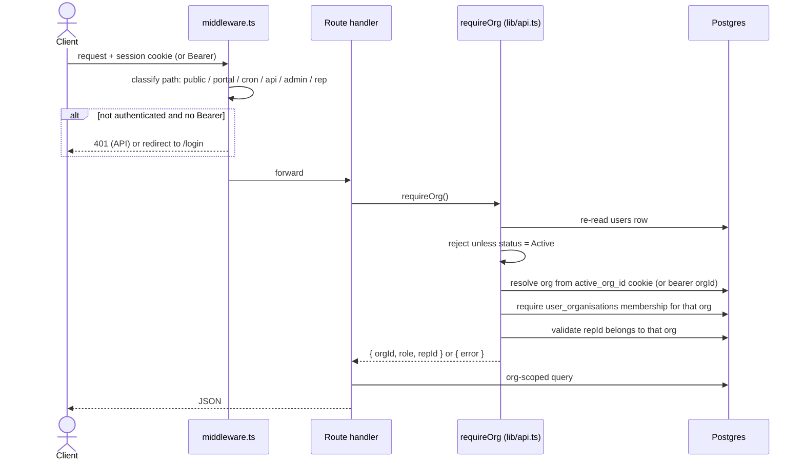
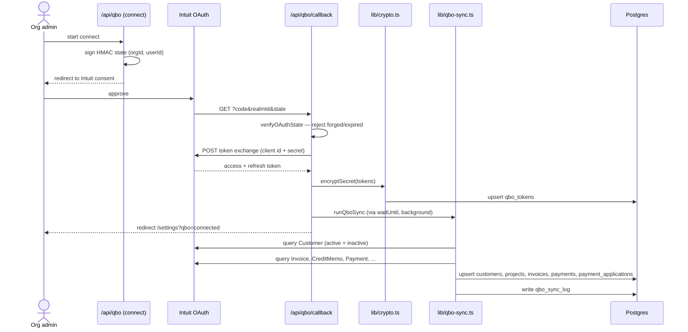
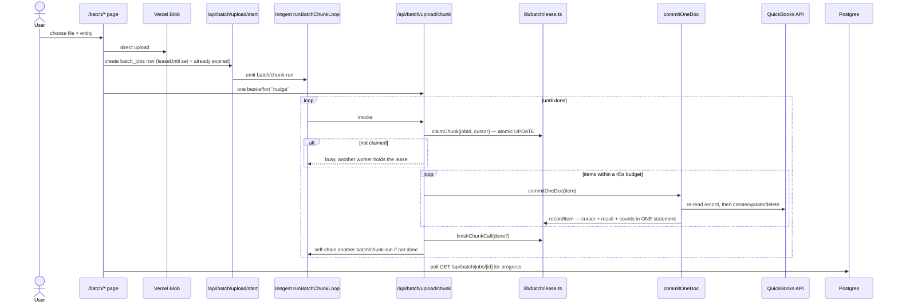

# Key Flows

- **Purpose:** The eight workflows that carry most of the system's value and most of its risk, each with its trigger, path, failure behaviour and edge cases.
- **Audience:** A developer tracing a bug, or working out what a change will disturb.
- **Last verified against:** commit `3eec3df` (2026-09-17)
- **Primary sources:** `middleware.ts`, `lib/credentials.ts`, `lib/qbo-sync.ts`, `inngest/functions/`, `app/api/portal/`, `lib/batch/`, `lib/accounting/documents.ts`, `app/api/webhooks/`

---

## 1. Sign in

**Trigger:** a person submits the login form at `/login` (or `/admin-login` on the admin host).

```mermaid
sequenceDiagram
    actor U as User
    participant MW as middleware.ts (Edge)
    participant NA as NextAuth /api/auth
    participant VC as lib/credentials.ts
    participant RL as lib/rate-limit.ts
    participant DB as Postgres
    participant AU as lib/audit.ts

    U->>MW: GET /login
    MW-->>U: public path; stamps x-org-subdomain if branded host
    U->>NA: POST credentials (email, password, mfaCode?)
    NA->>VC: verifyCredentials
    VC->>RL: rateLimit("login:<email>", 10, 900s)
    RL-->>VC: ok / throttled
    VC->>DB: select user by email
    VC->>VC: bcrypt.compare; status must be Active
    alt MFA enrolled
        VC->>VC: verifyTotp, else consumeRecoveryCode
    end
    VC->>DB: require a user_organisations membership
    VC-->>NA: VerifiedUser or null
    NA->>AU: logEvent("user_login")
    NA-->>U: Set-Cookie session JWT (8h)
    U->>MW: GET /dashboard
    MW-->>U: allowed (role-routed)
```

**Success path:** an 8-hour JWT session cookie. In production the cookie is
`__Secure-next-auth.session-token` scoped to `.primeaccountax.com`, so it is
shared with the admin subdomain.

**Failure and edge cases**

- More than 10 attempts per email in 15 minutes returns null — indistinguishable from a wrong password, by design.
- MFA blocks only users who have *enrolled*. A recovery code is consumed on use.
- A user with **no** `user_organisations` membership is set to `Inactive` and refused. Super admins are exempt.
- The rate limiter **fails open**: a database problem lets the attempt through rather than locking everyone out.
- `auth.config.ts` (used by middleware) declares **no providers** — credentials cannot run on the Edge runtime, so login goes through `/api/auth` on Node. Middleware only reads the resulting JWT.
- Mobile clients call `app/api/mobile/auth/*`, which uses the same `verifyCredentials` and returns a bearer token instead of a cookie.

---

## 2. Every authorised request (the tenancy gate)

**Trigger:** any request to a protected page or API route.



**Why it is written this way:** a serverless function keeps nothing between
requests, and a JWT can be 8 hours stale. Removing a `user_organisations` row or
setting `users.status = 'Inactive'` therefore blocks access on the *next*
request, not at the next login.

**Edge cases**

- A super admin bypasses the membership check and may act on any organisation via the cookie.
- `requireReadScope()` widens reads across an org *group* when `active_group_id` is set and the user holds `org_group_users` access. Writes deliberately stay on `requireOrg()`.
- A mobile bearer token carries the organisation chosen at login; it stands in for the cookie and is re-validated identically.
- Any client-supplied foreign key (`customerId`, `projectId`, `assigneeId`) must additionally pass `ownsInOrg()` or `userInOrg()` — a Postgres foreign key proves existence, not tenancy.

---

## 3. Connecting QuickBooks Online, then the first sync

**Trigger:** an admin clicks Connect in Settings.



**Success path:** encrypted tokens in `qbo_tokens`, a mirrored customer and
invoice set, and a `qbo_sync_log` row recording the run.

**Important details**

- The OAuth `state` is HMAC-signed and verified before `orgId` is trusted, so a connection cannot be bound to another organisation.
- The callback runs the first sync through `waitUntil` with `maxDuration = 60`, so the user is not left waiting — but a large first sync can be cut off by the platform limit.
- Subsequent syncs are **incremental**, bounded by the last successful `qbo_sync_log` timestamp minus a 10-minute safety buffer for clock skew and late indexing.
- **Customers are always fetched in full**, never date-filtered: QuickBooks does not reliably update a sub-customer's `LastUpdatedTime` when its parent changes, so a filtered fetch would silently strand invoices under the wrong customer.
- Inactive customers are fetched explicitly (`Active = false`) and merged — `select * from Customer` returns active rows only, which used to drop their invoices at the foreign-key step.
- Explicit `sleep()` calls between calls keep the run inside QuickBooks' rate limit.
- **Mirrored transactions are not posted to the general ledger.** Their ledger lives in QuickBooks; posting ours would double-count.
- Xero and Sage Intacct follow the same shape (`lib/xero-sync.ts`, `lib/sage-sync.ts`); Sage authenticates with stored credentials rather than OAuth.

---

## 4. The daily chase

**Trigger:** Inngest cron at 08:00 UTC (`chaseScheduler`). A legacy HTTP
equivalent also exists at `/api/cron` and a manual one at `/api/cron/trigger`.

```mermaid
sequenceDiagram
    participant CRON as Inngest cron 08:00
    participant SCH as chaseScheduler
    participant ORG as runOrgChase (per org, 2 retries)
    participant B as lib/billing.ts
    participant P as lib/portal.ts
    participant Q as lib/qbo-token.ts
    participant M as lib/mailer.ts
    participant DB as Postgres

    CRON->>SCH: fire
    SCH->>DB: list every organisation
    SCH->>ORG: send one invoice/chase-org event per org
    ORG->>M: hasEmailTransport(orgId)?
    ORG->>B: requireActiveSubscription(orgId)
    Note over ORG: stop if no transport, or blocked/readonly
    ORG->>DB: load active templates keyed by stage
    ORG->>DB: load invoices (exclude soft-deleted)
    ORG->>DB: load contacts due to be chased
    loop each due contact (own memoised step)
        ORG->>ORG: pick invoices; skip Paid, Written Off, zero balance,<br/>paused stages, automationsPaused
        ORG->>P: createPortalToken(...)
        ORG->>Q: fetchQboInvoiceLink per invoice
        ORG->>Q: fetchQboInvoicePdf (stamps pay button)
        ORG->>M: sendEmail(org mailbox)
        ORG->>DB: advance contacts.nextSendAt (only after a confirmed send)
        ORG->>DB: insert communications row
    end
    ORG->>DB: update organisations.lastCronRun / lastCronStats
```

**Why each contact is its own `step.run`:** on retry, Inngest memoises completed
steps, so already-sent contacts are skipped; one failure does not block the rest
of the organisation; and `nextSendAt` advances only after a confirmed send, so a
crash cannot silently skip a cycle.

**Failure and edge cases**

- No email transport, no active templates, or a blocked/read-only subscription: the organisation is skipped with a reason.
- Portal-link creation and PDF fetches fail silently — the email still goes out without them. A missing attachment is a disappointment; a failed chase run is worse.
- Stages `Disputed`, `On Hold`, `Promised`, `Promise to Pay` pause chasing, as does `automationsPaused` (set while a dispute is open).
- Soft-deleted invoices are excluded explicitly, so a debtor is never chased for an invoice QuickBooks has deleted.
- A separate `brokenPromiseSweep` (08:00) and `supplyChainWatchdog` (07:00) run on the same fan-out-per-org shape.

**Promise lifecycle, swept daily:** `Active` on creation, `Superseded` when a
newer promise replaces it, then `Met` or `Broken` by the cron sweeps in
`app/api/cron/route.ts`. The kept sweep runs **before** the broken one, so an
invoice paid *on* its promise date counts as kept. Both skip soft-deleted
invoices. On-time versus late is decided from `invoices.paidAt` sliced as a
string — round-tripping it through `Date()` reintroduces the timezone shift that
column exists to avoid.

---

## 5. The customer responds in the portal

**Trigger:** a debtor opens the tokenised link in a chase email.

```mermaid
sequenceDiagram
    actor D as Debtor
    participant MW as middleware.ts
    participant PG as /portal/[token] page
    participant API as /api/portal/[token]
    participant SUB as /api/portal/[token]/submit
    participant RL as rate-limit
    participant PR as lib/portal-response.ts
    participant RC as recomputeInvoiceState
    participant M as mailer
    participant DB as Postgres

    D->>MW: GET /portal/<token>
    MW-->>PG: public path, no auth
    PG->>API: validate token, load snapshot invoices
    API->>DB: token Active, not expired
    API->>API: resolve QBO pay links (parallel, capped at 20)
    API-->>D: invoices, PDF links, "Pay now" where payable
    D->>SUB: POST responses [promise and/or dispute per invoice]
    SUB->>RL: rateLimit("portal:submit:<token>", 10/hour)
    SUB->>DB: re-validate token; restrict to snapshot invoice ids
    SUB->>PR: buildPortalSubmission (pure, unit-tested)
    SUB->>DB: insert invoice_promises / invoice_disputes / communications
    SUB->>DB: resolve open disputes where a promise replaced them
    SUB->>RC: recomputeInvoiceState per invoice
    RC->>DB: sync stage to Committed / Disputed and pause automations
    SUB->>M: notify the collection owner
    SUB->>DB: mark token Completed (single use)
    SUB-->>D: confirmation
```

**Success path:** promise and dispute events recorded as first-class rows, the
invoice's cached state recomputed, staff notified, and the link retired.

**Failure and edge cases**

- The token is **single-use**: submitting marks it `Completed` and the link dies. A new request issues a fresh token. An expired or completed token returns **410 Gone**.
- Only invoice ids inside the token's own snapshot are accepted, so a debtor cannot act on another invoice by guessing an id.
- A note-only response is a real answer and must not be rejected — this was a shipped bug, and `buildPortalSubmission` is extracted as a pure function so `tests/portal-submit.test.ts` covers it.
- Portal link generation refuses a `*.vercel.app` host (`isPublicHost`): those sit behind Vercel Deployment Protection, so a debtor opening one is redirected to Vercel's login page. This reached customers once.
- The "Pay now" column is hidden entirely when nothing is payable, rather than rendering a dead button.

---

## 6. Posting a native document

**Trigger:** a user saves an Invoice, Bill, Payment, Expense or Journal from
`/accounting/new/[type]`.

```mermaid
sequenceDiagram
    actor U as User
    participant R as /api/accounting route
    participant PD as postDocument (lib/accounting/documents.ts)
    participant INV as lib/inventory/valuation.ts
    participant L as postJournalEntry (lib/ledger.ts)
    participant BR as bridgeNativeInvoice / bridgeNativeBill
    participant DB as Postgres

    U->>R: POST document form
    R->>R: requireOrg(); ownsInOrg for every referenced id
    R->>PD: postDocument(orgId, input, actorId)
    PD->>PD: build debit/credit lines from the document type
    alt line references a tracked item
        PD->>INV: plan FIFO issue / receipt (read-only)
        INV-->>PD: exact cost layers
        PD->>PD: append Dr COGS / Cr Inventory at FIFO cost
    end
    PD->>L: postJournalEntry(lines)
    L->>L: validate balance, one side per line, accounts Active in org
    L->>DB: insert journal_entries header
    L->>DB: insert journal_lines
    alt a line insert fails
        L->>DB: delete the header (compensating action)
        L-->>PD: throw
    end
    PD->>BR: mirror into invoices / ap_bills
    PD->>INV: commit lots, then recalcItemCache
    PD-->>U: entry id + document number
```

**Invariants that make this safe without transactions:** all validation happens
before the first write, so the only failure mode inside the write window is
infrastructure; the header is written first and deleted on failure; inventory is
planned read-only, then committed, then the cache is recalculated.

**Failure and edge cases**

- An entry that does not balance to the cent is rejected with a readable message; it is never "plugged".
- An Invoice **requires** a customer. `bridgeNativeInvoice` used to return quietly without one, leaving a balance in the A/R control account with no receivable row — invisible to collections and to aging. The bridge now logs loudly.
- Corrections are reversals. `deleteDocument` and `onEntryReversed` maintain `reversedByEntryId` / `reversesEntryId` rather than removing history.
- Provider-synced bills are deliberately **not** posted.
- Credit notes and vendor credits do not yet move stock — a known gap.
- After any change here, run `/admin/reconcile` or `scripts/reconcile-foundation.ts`.

---

## 7. Data Studio bulk write to QuickBooks

**Trigger:** a user uploads a spreadsheet at `/batch/upload` (or runs modify,
delete, or bulk-edit).



**Why it is shaped like this**

- **Processing is server-driven.** The browser used to run the chunk loop itself, so closing the tab silently stopped the import. Inngest self-chaining makes it independent of any tab; the client only nudges once and then polls.
- **`claimChunk` is an atomic conditional `UPDATE`** on `(id, processedCount, expired lease)`, so a client nudge racing the Inngest chain can never process the same cursor twice.
- **`recordItem` writes cursor, result and counters in one statement**, so a crash loses at most the in-flight item.
- **`lib/batch/reap.ts` resumes before it gives up.** A stuck *chunked* job (identified by a set-and-expired `leaseUntil`) is nudged rather than failed, and only abandoned after about 20 minutes — with an honest count such as "71 of 300 attempted; the remaining 229 were never attempted". A `batchJobWatchdog` cron does the same every two minutes. Legacy whole-job runners never set `leaseUntil`, which is exactly what stops the watchdog from firing a second concurrent processor at a healthy legacy job.

**Rules that exist because of real corruption**

- **Update always re-reads the record and uses *its* `SyncToken`**, never the sheet's. A downloaded sheet's token is stale the moment anything else touches the record, and QuickBooks rejects it with a misleading "someone is working on this at the same time".
- **An update carrying a `Line` array must be a FULL update, not a sparse patch.** Under `sparse: true` a line without its own line-level id is treated as a *new* line, and Data Studio never round-trips per-line ids — so every edit appended instead of replacing. `CustomField` is merged forward from the re-read record to compensate for going full.
- **Every write path must go through `commitOneDoc`.** A second inline copy of this logic lived in `commit-runner.ts` and kept running the old broken version after the fix. After any correctness fix here, grep the tree for another copy.
- **Open investigation:** removing a line from a QuickBooks *Deposit* returns 200 OK but keeps the omitted lines. A delete-and-recreate fix was reverted because it changes the deposit's internal id and resets bank reconciliation. Do not ship another deposit-line-removal fix on the money path until the `deposit-reduce` diagnostic settles it.

**Known residual risk:** if a QuickBooks write succeeds but the process dies
before `recordItem` commits, a retry reprocesses that item — a possible duplicate
create whose id is never logged, so Undo cannot find it. The window is one
database write, not a whole chunk. It predates the shared engine.

---

## 8. Subscription billing — invoice first, subscribe after payment

**Trigger:** a platform admin creates a recurring Stripe invoice for an
organisation.

```mermaid
sequenceDiagram
    actor PA as Platform admin
    participant R as /api/admin/billing/create-invoice
    participant S as Stripe
    participant W as /api/webhooks/stripe
    participant B as lib/billing.ts
    participant DB as Postgres

    PA->>R: create recurring invoice (amount, terms)
    R->>DB: reject if a live subscription already exists (400)
    R->>S: invoices.create (send_invoice, real days_until_due)
    R->>S: invoiceItems.create, finalizeInvoice, sendInvoice
    R->>DB: insert subscriptions row, status "incomplete"
    Note over R,S: no Stripe Subscription object exists yet
    S-->>PA: emailed invoice with real due date
    PA->>S: customer pays
    S->>W: invoice.paid
    W->>W: metadata.purpose == subscription_first_invoice?
    W->>S: retrieve PaymentIntent payment method; set as customer default
    W->>S: subscriptions.create (charge_automatically,<br/>trial_end one interval out)
    W->>B: activateOrgOnPayment
    B->>DB: grant access
```

**Why two steps:** Stripe's `days_until_due` only applies with
`collection_method: 'send_invoice'`, so the admin form's payment-terms field was
silently discarded for recurring mode. Worse, for a `charge_automatically`
subscription Stripe documents that if the first invoice is not paid within **23
hours** the subscription becomes `incomplete_expired` — a terminal status that
**voids the open invoice**. That is what voided a real customer's 14-day invoice;
it is fixed Stripe behaviour and not configurable. `due_date` and
`collection_method` can only be changed on *draft* invoices, so an already
finalised invoice cannot be patched afterwards — that is a support matter, not a
code fix.

`trial_end` one interval out means the period already paid for manually is not
billed again; the subscription starts `trialing` and charges cleanly at period 2.

**Access gating:** `requireActiveSubscription(orgId)` returns
`full` / `readonly` / `blocked`. No subscription row at all means `full`. The
daily chase checks it before sending anything.

---

## Cross-cutting: how failures are handled

| Kind of failure | Behaviour |
|---|---|
| Transient Neon `fetch` failure | Retried 3 times with backoff (`db/index.ts`) |
| Provider API error mid-sync | Logged to `*_sync_log`; the run reports partial results |
| Provider token expired | Refresh attempted; `QboTokenRefreshBlocked` stops a refresh storm |
| Email send failure | The chase step fails; Inngest retries the *contact*, and `nextSendAt` is not advanced |
| PDF or pay-link fetch failure | Silently skipped; the email still sends |
| Audit or communication log failure | Swallowed; never breaks the primary action |
| Rate limiter database failure | Fails **open** |
| Background job killed mid-run | Chunked jobs resume from the cursor; the watchdog nudges them |
| Ledger line insert failure | Header deleted as a compensating action |

## Sources

`middleware.ts`; `lib/credentials.ts`; `lib/auth.ts`; `lib/api.ts`;
`app/api/qbo/callback/route.ts`; `lib/qbo-sync.ts`; `lib/qbo-token.ts`;
`inngest/functions/chase.ts`; `inngest/functions/batch.ts`;
`app/api/cron/route.ts`; `app/api/portal/[token]/route.ts`;
`app/api/portal/[token]/submit/route.ts`; `lib/portal.ts`;
`lib/portal-response.ts`; `lib/ledger.ts`; `lib/accounting/documents.ts`;
`lib/batch/lease.ts`; `lib/batch/commit-one.ts`; `lib/batch/reap.ts`;
`app/api/webhooks/stripe/route.ts`; `lib/billing.ts`; `CLAUDE.md`.
