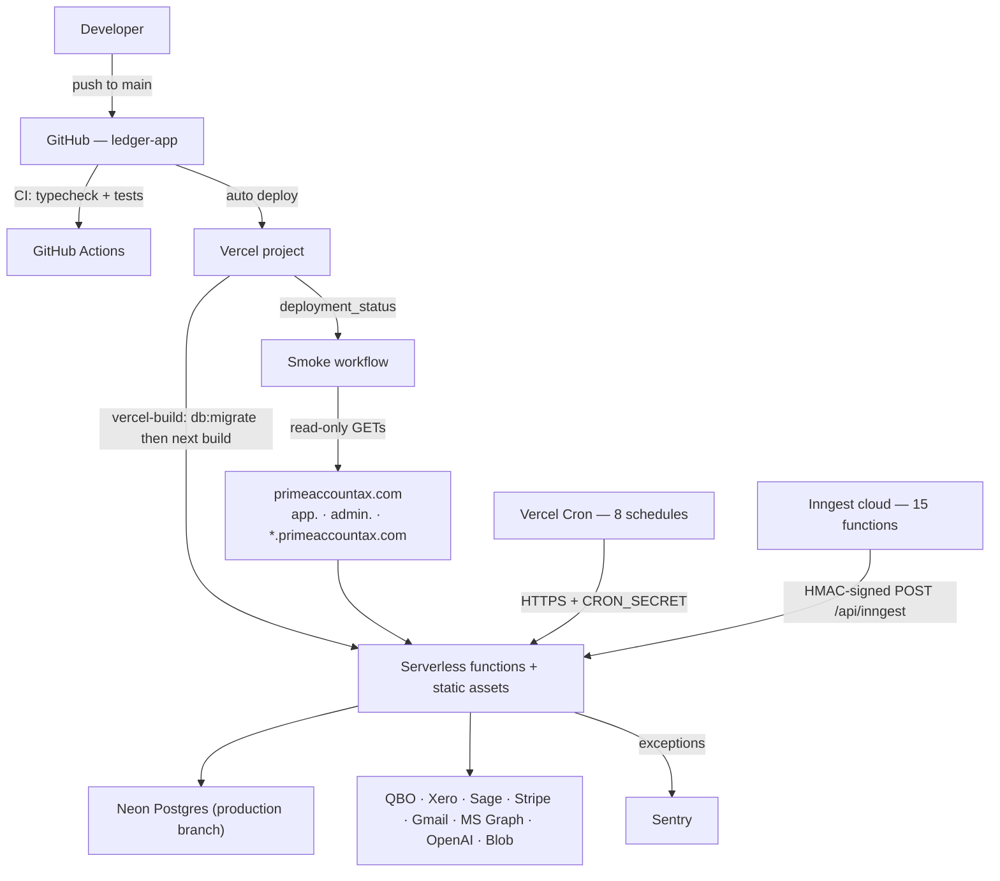

# Build, Deploy and Operations

- **Purpose:** How the code becomes a running system, and how you look after it once it is.
- **Audience:** Whoever is on call, or shipping a change.
- **Last verified against:** commit `3eec3df` (2026-09-17)
- **Primary sources:** `package.json`, `.github/workflows/`, `vercel.json`, `next.config.js`, `scripts/`, `inngest/`, `app/api/health/route.ts`

## Build

| Command | What it does |
|---|---|
| `npm run dev` | Next dev server on port 3000 |
| `npm run build` | `next build` |
| `npm run vercel-build` | **`npm run db:migrate && next build`** — this is what Vercel runs, so **migrations are applied as part of every production deploy** |
| `npm start` | Serve a built app |
| `npm run typecheck` | `tsc --noEmit` |
| `npm test` | `vitest run` |

Two build-time settings in `next.config.js` are worth knowing before you trust a
green build:

```js
typescript: { ignoreBuildErrors: true },
eslint:     { ignoreDuringBuilds: true },
```

A type error **will not fail the build**. Only CI's `npm run typecheck` catches
it. There is no lint step anywhere in the pipeline.

Also configured at build time:

- **Security headers** on every route: HSTS (2 years, `includeSubDomains; preload`), `X-Frame-Options: DENY`, `X-Content-Type-Options: nosniff`, `Referrer-Policy: strict-origin-when-cross-origin`, `Permissions-Policy` disabling camera/microphone/geolocation/payment.
- **Server Action origin allowlist**: the four Prime Accountax hosts, `*.primeaccountax.com`, and `localhost:3000`.
- **`serverComponentsExternalPackages`**: `openai`, `imapflow`, `mailparser`, `nodemailer`, `unpdf`. `unpdf` in particular must stay a real Node import — its bundled pdfjs uses `import.meta` directly, which webpack flags as a critical dependency and which risks breaking at runtime if bundled.
- **Nine permanent (308) redirects** for the Supply Chain restructure and the retired Accounting party screens. `app/api/**` was deliberately not touched by that move, because the mobile app calls those routes directly.
- **Sentry wrapping is conditional** on a DSN being set, so the build is byte-identical until you opt in.

## Continuous integration

### `.github/workflows/ci.yml` — on every push to `main` and every pull request

Node 20 (matching the pinned `@types/node` major), `npm ci`, then:

1. `npm run typecheck`
2. `npm test`

Current state, verified locally at this commit: **17 test files, 252 tests, all
passing; typecheck exits 0.**

Two deliberate omissions, both documented in the workflow itself:

- **CI does not run `next build`.** Several routes need real Stripe and Intuit keys and fail at page-data collection without them, so a build here would go red for a missing environment variable rather than a defect.
- **CI has no database.** Database-backed checks live in `scripts/reconcile-foundation.ts` and `/admin/reconcile`, which run against production. A fabricated database would prove nothing.

`mobile/` is explicitly not installed or checked here.

### `.github/workflows/smoke.yml` — production smoke test

Triggers: Vercel `deployment_status` (only on a **successful Production**
deploy), every 30 minutes on a schedule, and manual dispatch with a base URL.

`npm run smoke` (`scripts/smoke.ts`) makes read-only GETs against the live site,
plus a single login POST. It writes nothing, sends nothing, and never calls
QuickBooks.

| Check | Why it exists |
|---|---|
| `/` returns 200 | the marketing site is up at all |
| `/login` returns 200 | staff and customers can sign in |
| `/api/health` returns 200 | the app can reach its database |
| `/google<token>.html` returns the token, un-redirected | Google verification gates the OAuth review, which gates Gmail sending |
| `/portal/<bogus token>` does not redirect off-site | the portal once redirected debtors to a Vercel login page |
| `/api/invoices`, `/api/customers`, `/api/reports/ar-snapshot?live=1`, `/api/reports/ar-aging`, `/api/payables/suppliers`, `/api/org/settings` | the core signed-in surfaces — `suppliers` is on the list because it returned 500 for days until a customer reported it |

The signed-in checks only run when `SMOKE_EMAIL` and `SMOKE_PASSWORD` (a
dedicated **read-only** account) are configured as repository secrets. Without
them only the anonymous checks run — still useful, but blind to the class of
failure that has actually hurt.

This workflow exists because every regression that reached a paying client had
the same shape: a URL that returned 200 yesterday returns 500 or a redirect
today, and nobody edited the thing that broke.

## Deployment topology



How to read it: there is one artefact and one environment boundary. Both
schedulers reach the application from outside over HTTPS, which is why both
their paths must stay in middleware's bypass list. The `*.primeaccountax.com`
wildcard is what makes white-label subdomains resolve, and attaching it is a
manual step in the Vercel dashboard plus DNS — not something this repository can
do.

Hosts:

| Host | Serves |
|---|---|
| `primeaccountax.com` | Marketing site and the app |
| `app.primeaccountax.com` | The app |
| `admin.primeaccountax.com` | Rewritten to `/admin/*` by middleware; `platform_admin` / `super_admin` only; its own login page |
| `<org>.primeaccountax.com` | Branded pre-auth pages only (login, register success, forgot/reset password) |
| `*.vercel.app` | A "coming soon" placeholder for non-API paths in production |

## Scheduled and background jobs

Full tables are in [06-interfaces-and-integrations.md](06-interfaces-and-integrations.md).
Summary of what runs unattended, by time (UTC):

| Time | Job | Owner |
|---|---|---|
| `*/2 min` | `batchJobWatchdog` — resume stuck chunked jobs | Inngest |
| hourly | `scheduledImportScan` | Inngest |
| 02:00 | QuickBooks sync (HTTP cron) / Xero sync (Inngest) | both |
| 03:00 | Xero sync (HTTP cron) / QuickBooks sync (Inngest) | both |
| 04:00 | Replay failed webhooks | Vercel Cron |
| 05:00 | Sage sync | Vercel Cron |
| 06:00 | Forecast snapshot; `ledgerHealthCheck` | Vercel Cron; Inngest |
| 07:00 | Inbound AR mailbox sync; `supplyChainWatchdog` | Vercel Cron; Inngest |
| 07:30 | Inbound mailbox sync | Vercel Cron |
| 08:00 | Lead sequence processor; chase; broken-promise sweep | Vercel Cron; Inngest |

**Note the overlap:** QuickBooks and Xero syncing exist on *both* schedulers at
adjacent times. [UNVERIFIED] Whether the HTTP cron paths are still wanted now
that the Inngest schedulers exist is not stated anywhere; treat it as an open
question rather than assuming one is dead.

## Monitoring and observability

| Signal | Where |
|---|---|
| **Uptime and database reachability** | `GET /api/health` — 200 with latency, or 503. No auth, safe for external monitors. |
| **End-to-end production health** | The smoke workflow, every 30 minutes and after every deploy |
| **Exceptions** | Sentry, when a DSN is configured. `tracesSampleRate: 0.1`. Completely inert otherwise. |
| **Application logs** | `console.*` to Vercel's log drain. No structured logging library. |
| **Domain audit trail** | `audit_events` table via `lib/audit.ts` — logins, role changes, integration connect/disconnect, stage changes, approvals, exports |
| **Sync history** | `qbo_sync_log`, `xero_sync_log`, `sage_sync_log`; plus `/api/qbo/webhook-health` and `/api/xero/webhook-health` |
| **Chase outcome** | `organisations.last_cron_run` and `last_cron_stats` (emails sent, skipped, errors) |
| **Ledger integrity** | `ledgerHealthCheck` daily at 06:00; `/admin/reconcile` on demand |
| **Batch job progress** | `batch_jobs` rows, polled by the UI at `GET /api/batch/jobs/[id]` |
| **Billing** | `billing_audit_logs`, `stripe_webhook_events` |

There is **no alerting** configured in this repository — no PagerDuty, no Slack
webhook, no Sentry alert rules in code. A red smoke run is a GitHub notification;
a 503 from `/api/health` is only noticed by whatever external monitor someone
pointed at it. [UNVERIFIED] Whether such a monitor exists.

## Common operational tasks

| Task | How |
|---|---|
| **Apply migrations** | Automatic on deploy (`vercel-build`). Manually: `npm run db:migrate`, ideally against a Neon **branch** first. |
| **Verify ledger integrity** | `/admin/reconcile` in the app (runs server-side against production), or `npx tsx scripts/reconcile-foundation.ts` (exit 1 on failure) |
| **Force a full provider re-sync** | `POST /api/qbo/sync` with a full-sync option, or the per-org cron path with `CRON_SECRET` |
| **Re-run a stuck Data Studio job** | It self-heals within about 20 minutes via `batchJobWatchdog`. To force it: `POST /api/batch/jobs/[id]/run-chunk-now`. |
| **Undo a Data Studio import** | `POST /api/batch/jobs/[id]/undo`, which uses the recorded per-item ids |
| **Replay failed webhooks** | `/api/cron/replay-webhooks` (also runs at 04:00) |
| **Dry-run the chase** | `/api/cron/trigger` with `dryRun` — skips PDF fetches and sends nothing |
| **Assign a module to an org** | `/admin/customers/[orgId]` → Modules card → `PATCH /api/admin/organisations/[id]/modules` |
| **Set an org's branded subdomain** | The subdomain editor on `/admin/customers/[orgId]`. **Also needs the wildcard domain and DNS to exist.** |
| **Check a smoke failure** | Re-run with `workflow_dispatch` against a specific base URL |

## Known failure modes and their signatures

| Symptom | Likely cause |
|---|---|
| Debtors land on a Vercel login page from a portal link | A customer link was built from a `*.vercel.app` host. `isPublicHost()` guards this; check `NEXT_PUBLIC_APP_URL`. |
| A page 500s that nobody edited | A `GROUP BY` against the `customers` / `ap_suppliers` views, or another view-related change. Invisible to `tsc` and to the unit suite. |
| Background jobs never run | `/api/inngest` not reachable — check middleware's bypass list and the Inngest dashboard's sync attempts. This was broken in production for weeks once. |
| Dates render one day early for US users | A date-only value passed through `new Date()` or `+ "T00:00:00Z"`. `tests/date-display.test.ts` covers the formatters. |
| A table silently missing after deploy | A migration journal `when` that is not strictly greater than its predecessor — Drizzle skips it without error. |
| Chase emails stop for one org | No email transport, no active templates, or a `blocked` / `readonly` subscription. Check `organisations.last_cron_stats`. |
| QuickBooks rejects an update with "someone is working on this at the same time" | A stale `SyncToken` from a downloaded sheet. `commitOneDoc` re-reads first; check no second copy of that logic is in play. |
| A Stripe subscription invoice is voided about a day after issue | A `charge_automatically` subscription whose first invoice went unpaid for 23 hours. Use the two-step invoice-first flow. |
| Local queries disagree with production | `.env.local` points at a database that is behind. Compare `drizzle.__drizzle_migrations` with `meta/_journal.json`. |

## Sources

`package.json`; `next.config.js`; `vercel.json`; `.github/workflows/ci.yml`;
`.github/workflows/smoke.yml`; `scripts/smoke.ts`; `scripts/migrate.ts`;
`scripts/reconcile-foundation.ts`; `app/api/health/route.ts`;
`app/api/inngest/route.ts`; `inngest/functions/*`; `lib/batch/reap.ts`;
`lib/audit.ts`; `sentry.*.config.ts`; `middleware.ts`; `DEPLOY.md`; `CLAUDE.md`.
